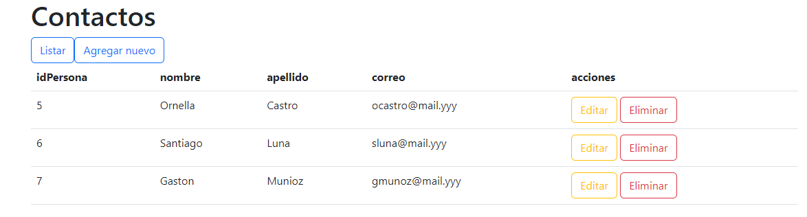

# web.crud ✏📖📝🗑

```
El famoso CRUD de su acronimo Create Read Update Delete 
Es un proyecto que me permitio configurar un servidor local, 
realizar conexion a la base de datos y utilizar el modelo vista controlador MVC.

```
### Programas usados:
* IDE: Netbeans
* Servidores: Glassfish y WampServer
* Lenguaje Java
* BaseDatos: MySQL



